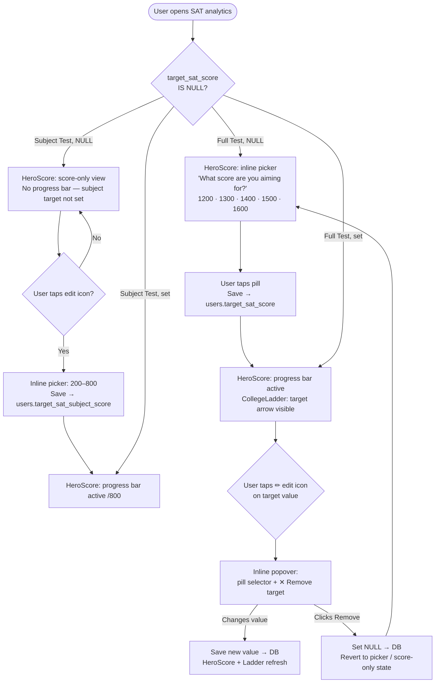
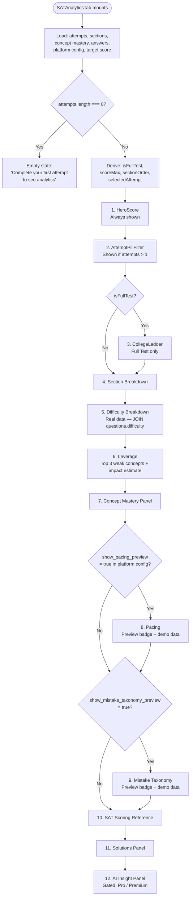

# PRD KSS-SAT-A02: SAT Analytics V2 — Enhanced Analytics + Platform Config Restructure

**Status:** DRAFT  
**Author:** Sandesh Banakar I  
**Stakeholders:** Engineering, Product, QA, Design  
**Target Version:** V1 Demo  
**Depends on:** KSS-SAT-A01 (existing SATAnalyticsTab), KSS-SA-037 (Concept Tags + Platform Config)  
**Date:** Apr 19 2026

---

## 1. Executive Summary

### 1.1 Problem Statement
The current SAT analytics tab (`SATAnalyticsTab.tsx`) shows 8 basic blocks (score grid, section bars, concept mastery, weak concepts, scoring reference, solutions, AI insight). It is functional but not **engaging** — it does not motivate students with a goal (target score), gamify progress (college eligibility ladder), or give actionable insights beyond weak concepts.

The Platform Config page is a flat Concept Tags CRUD with no exam-category structure — it cannot support growing per-category configuration needs.

### 1.2 What We're Building
1. **Enhanced SAT Analytics** — 10 sections including a goal-driven HeroScore, College Ladder gamification, Difficulty Breakdown (real data), and two demo-mode Preview sections (Pacing, Mistake Taxonomy).
2. **Platform Config Restructure** — Exam-category tab architecture with Concept Tags + Analytics Display sub-tabs per category.
3. **DB Schema additions** — `sat_tier_bands`, `sat_colleges`, `platform_analytics_config`, `users.target_sat_score`, `users.target_sat_subject_score`.

### 1.3 What is NOT in this ticket
- StudyPlan (deferred — requires SA YouTube video management per concept tag)
- Peer Percentile (deferred — requires cohort aggregation)
- Floating Tweaks panel (removed — replaced by Platform Config)
- Exam engine wiring for Pacing + MistakeTaxonomy (deferred — exam engine ticket)
- Target score on login/signup form (deferred — B2C onboarding ticket)

---

## 2. User Personas & Impact

| Persona | Impact |
|:---|:---|
| **Super Admin** | Can manage college targets + tier bands per SAT from Platform Config. Can toggle Preview sections on/off per exam category. Platform Config now has a clear exam-category tab structure. |
| **B2C Student (SAT)** | Sees goal-oriented analytics — HeroScore with target progress, college eligibility ladder, difficulty breakdown. Can set/edit/remove target score inline. |
| **Demo Stakeholder** | Sees a full-featured, visually engaging analytics experience. Preview sections show plausible data so the demo looks complete. |

---

## 3. System Architecture

### 3.1 Platform Config Page — New Structure

```
/super-admin/platform-config
│
├── Tabs: dynamically loaded from exam_categories table (id, name)
│   ├── [SAT]
│   │   ├── [Concept Tags]     ← existing CRUD, filtered to exam_category = SAT
│   │   └── [Analytics Display] ← NEW (see §7)
│   ├── [NEET]
│   │   ├── [Concept Tags]     ← filtered
│   │   └── [Analytics Display] ← "Coming Soon"
│   ├── [JEE]  → same pattern
│   └── [CLAT] → same pattern
│
└── Note: tabs order = alphabetical by exam_categories.name
```

### 3.2 SATAnalyticsTab — New Section Order

| # | Section | Test Type | Data Source | Real/Demo |
|---|---|---|---|---|
| 1 | HeroScore | Both | `attempts` + `users.target_sat_score` / `target_sat_subject_score` | Real |
| 2 | AttemptPillFilter | Both | `attempts` | Real |
| 3 | College Ladder | Full Test only | `sat_colleges` + `sat_tier_bands` + `users.target_sat_score` | Real |
| 4 | Section Breakdown | Both | `attempt_section_results` | Real |
| 5 | Difficulty Breakdown | Both | `attempt_answers` JOIN `questions.difficulty` | Real |
| 6 | Leverage | Both | `user_concept_mastery` | Real (computed) |
| 7 | Concept Mastery Panel | Both | `user_concept_mastery` | Real |
| 8 | Pacing | Both | Hardcoded demo | **Preview** |
| 9 | Mistake Taxonomy | Both | Hardcoded demo | **Preview** |
| 10 | SAT Scoring Reference | Both | Static table | Static |
| 11 | Solutions Panel | Both | `attempt_answers` + `questions` | Real |
| 12 | AI Insight Panel | Both | `attempt_ai_insights` | Real (gated Pro/Premium) |

---

## 4. Flow Diagrams

### 4.1 Target Score State Machine



### 4.2 Analytics Rendering Decision Flow



### 4.3 CollegeLadder Data & Rendering Flow

```mermaid
flowchart LR
    DB1[(sat_tier_bands)] --> TIER[Tier Bands\nAccessible · Top-100 · Top-50\nTop-20 · Elite]
    DB2[(sat_colleges)] --> COL[College List\nname · country · cutoff · aid%]
    DB3[(users.target_sat_score)] --> TARGET[Target Score\nnullable]
    ATT[(attempts.score latest)] --> CURR[Current Score]

    CURR --> UNLOCK{college.cutoff_score\n≤ current_score?}
    UNLOCK -- Yes → Unlocked card
    UNLOCK -- No → Locked card

    CURR --> TIERPOS[Position on tier rail]
    TARGET --> TARGETPOS{IS NULL?}
    TARGETPOS -- Yes --> HINT[Show hint text:\n'Set a target to see your gap\nto each college tier']
    TARGETPOS -- No --> ARROW[Target arrow on tier rail]
```

### 4.4 Platform Config Restructure Flow

```mermaid
flowchart TD
    PC[/super-admin/platform-config] --> LOAD[Load exam_categories\nORDER BY name]
    LOAD --> TABS[Render exam-category tabs\ne.g. SAT · NEET · JEE · CLAT]
    TABS --> SELECT{Selected tab?}

    SELECT -- SAT --> SAT_SUB[Sub-tabs: Concept Tags · Analytics Display]
    SAT_SUB --> CT_SAT[Concept Tags\nExisting CRUD filtered to SAT]
    SAT_SUB --> AD_SAT[Analytics Display\nSee §7 for full spec]

    SELECT -- NEET/JEE/CLAT --> OTHER_SUB[Sub-tabs: Concept Tags · Analytics Display]
    OTHER_SUB --> CT_OTHER[Concept Tags\nFiltered to that category]
    OTHER_SUB --> AD_OTHER[Analytics Display\n'Coming Soon' placeholder]
```

---

## 5. DB Schema — New Migrations

### KSS-DB-041 — `sat_tier_bands`
```sql
CREATE TABLE IF NOT EXISTS sat_tier_bands (
  id            uuid PRIMARY KEY DEFAULT gen_random_uuid(),
  name          text NOT NULL,          -- e.g. 'Accessible'
  label         text NOT NULL,          -- Display: 'Accessible', 'Elite / Ivy'
  min_score     integer NOT NULL CHECK (min_score BETWEEN 400 AND 1600),
  max_score     integer NOT NULL CHECK (max_score BETWEEN 400 AND 1600),
  color         text NOT NULL,          -- Tailwind base token: 'zinc'|'teal'|'blue'|'violet'|'amber'
  display_order integer NOT NULL DEFAULT 0,
  created_at    timestamptz DEFAULT now(),
  updated_at    timestamptz DEFAULT now()
);

-- Seed
INSERT INTO sat_tier_bands (name, label, min_score, max_score, color, display_order) VALUES
('Accessible', 'Accessible',  1000, 1199, 'zinc',   1),
('Top-100',    'Top-100',     1200, 1349, 'teal',   2),
('Top-50',     'Top-50',      1350, 1429, 'blue',   3),
('Top-20',     'Top-20',      1430, 1499, 'violet', 4),
('Elite',      'Elite / Ivy', 1500, 1600, 'amber',  5);
```

### KSS-DB-042 — `sat_colleges`
```sql
CREATE TABLE IF NOT EXISTS sat_colleges (
  id             uuid PRIMARY KEY DEFAULT gen_random_uuid(),
  name           text NOT NULL,
  country        text NOT NULL CHECK (country IN ('US', 'IN')),
  cutoff_score   integer NOT NULL CHECK (cutoff_score BETWEEN 400 AND 1600),
  aid_pct        integer NOT NULL DEFAULT 0 CHECK (aid_pct BETWEEN 0 AND 100),
  logo_initials  text,                  -- 2–4 char badge fallback, e.g. 'MIT', 'UCB'
  is_active      boolean DEFAULT true,
  display_order  integer DEFAULT 0,     -- auto-sort by cutoff_score desc; SA can override
  created_by     uuid REFERENCES admin_users(id),
  created_at     timestamptz DEFAULT now(),
  updated_at     timestamptz DEFAULT now()
);

-- Seed (19 colleges — ordered cutoff DESC)
INSERT INTO sat_colleges (name, country, cutoff_score, aid_pct, logo_initials) VALUES
('MIT',                   'US', 1540, 100, 'MIT'),
('Stanford',              'US', 1530, 100, 'SU'),
('Princeton',             'US', 1520, 100, 'P'),
('Columbia',              'US', 1510, 100, 'C'),
('Cornell',               'US', 1480, 60,  'C'),
('Carnegie Mellon',       'US', 1480, 55,  'CMU'),
('UC Berkeley',           'US', 1440, 40,  'UCB'),
('UCLA',                  'US', 1410, 35,  'UCLA'),
('NYU',                   'US', 1400, 45,  'NYU'),
('University of Michigan','US', 1390, 30,  'UM'),
('Purdue',                'US', 1350, 40,  'P'),
('UT Austin',             'US', 1340, 35,  'UT'),
('Boston University',     'US', 1340, 50,  'BU'),
('Penn State',            'US', 1300, 25,  'PSU'),
('Arizona State',         'US', 1260, 40,  'ASU'),
('BITS Pilani (US prog)', 'IN', 1250, 20,  'BITS'),
('Ashoka University',     'IN', 1200, 50,  'A'),
('FLAME University',      'IN', 1150, 40,  'F'),
('Symbiosis SLS',         'IN', 1100, 30,  'SSLS');
```

### KSS-DB-043 — `users` table — target score columns
```sql
ALTER TABLE users
  ADD COLUMN IF NOT EXISTS target_sat_score integer
    CHECK (target_sat_score BETWEEN 400 AND 1600);

ALTER TABLE users
  ADD COLUMN IF NOT EXISTS target_sat_subject_score integer
    CHECK (target_sat_subject_score BETWEEN 200 AND 800);
```

### KSS-DB-044 — `platform_analytics_config`
```sql
CREATE TABLE IF NOT EXISTS platform_analytics_config (
  id               uuid PRIMARY KEY DEFAULT gen_random_uuid(),
  exam_category_id uuid NOT NULL REFERENCES exam_categories(id) ON DELETE CASCADE,
  config_key       text NOT NULL,   -- see valid keys below
  config_value     boolean NOT NULL DEFAULT true,
  updated_by       uuid REFERENCES admin_users(id),
  updated_at       timestamptz DEFAULT now(),
  UNIQUE (exam_category_id, config_key)
);

-- Valid config_key values for SAT:
--   'show_college_ladder'           DEFAULT true
--   'show_pacing_preview'           DEFAULT true
--   'show_mistake_taxonomy_preview' DEFAULT true

-- Seed defaults for SAT (get SAT exam_category_id first)
-- Run after finding SAT's exam_category_id:
-- INSERT INTO platform_analytics_config (exam_category_id, config_key, config_value)
-- SELECT id, 'show_college_ladder', true FROM exam_categories WHERE name = 'SAT'
-- UNION ALL
-- SELECT id, 'show_pacing_preview', true FROM exam_categories WHERE name = 'SAT'
-- UNION ALL
-- SELECT id, 'show_mistake_taxonomy_preview', true FROM exam_categories WHERE name = 'SAT';
```

---

## 6. Section-by-Section Calculations

### 6.1 HeroScore

| Property | Formula | Notes |
|---|---|---|
| Latest score | `attempts[attempts.length-1].score` | Full test: 400–1600. Subject test: 200–800 |
| First score | `attempts[0].score` | For delta calc |
| Delta | `latest.score - first.score` | Show as +N (green) / -N (red) / 0 (neutral) |
| Target (full) | `users.target_sat_score` | Nullable — show picker if null |
| Target (subject) | `users.target_sat_subject_score` | Nullable — show picker if null |
| Progress % | `clamp(((latest - minScore) / (target - minScore)) × 100, 0, 100)` | minScore = 400 (full) / 200 (subject) |
| Chart Y range | Full: 400–1600. Subject: 200–800 | SVG inline (no charting library) |
| R&W / Math | `lastAttempt.score_rw` + `lastAttempt.score_math` | Full test only |
| Sub-delta | `last.score_rw - first.score_rw`, same for math | Full test, ≥2 attempts only |

**Edit target:** Small `Pencil` (lucide) icon next to target value. Opens inline popover:
- Pill selector (1200/1300/1400/1500/1600 for full, 400–800 in steps of 100 for subject)
- `✕ Remove target` text link at bottom
- On save: `UPDATE users SET target_sat_score = $val WHERE id = $userId`
- On remove: `UPDATE users SET target_sat_score = NULL WHERE id = $userId`

**Empty state (no attempts):** "Complete your first attempt to see your score journey."

### 6.2 College Ladder (Full Test Only)

**Data load:** `sat_tier_bands` (all rows, ordered by `display_order`) + `sat_colleges WHERE is_active = true` ordered by `cutoff_score DESC` + `users.target_sat_score`.

| Property | Logic |
|---|---|
| Unlocked colleges | `college.cutoff_score <= currentScore` |
| Locked colleges | `college.cutoff_score > currentScore` |
| Current tier | Last tier band where `currentScore >= band.min_score` |
| Next tier | First tier band where `currentScore < band.min_score` |
| Points to next tier | `nextTier.min_score - currentScore` |
| "Next unlock" | `locked[0]` (lowest cutoff locked college) |
| Points to next unlock | `nextUnlock.cutoff_score - currentScore` |
| Target arrow | Rendered only when `target_sat_score IS NOT NULL` |
| No-target hint | `"Set a target score to see your gap to each college tier"` |
| Country filter | Pills: All · 🇺🇸 US · 🇮🇳 India (client-side filter, no re-fetch) |

**Not shown for subject tests.** `isFullTest === false` → section is skipped entirely.

### 6.3 Section Breakdown (enhanced)

Existing data: `attempt_section_results` — already has `time_spent_seconds`.

Enhancement: display time alongside marks.

| Display | Source | Format |
|---|---|---|
| Module label | `sec.section_label` | "R&W · Module 1" |
| Correct/Total | `sec.correct_count / (sec.correct_count + sec.incorrect_count + sec.skipped_count)` | "19/27" |
| Time | `sec.time_spent_seconds` | `MM:SS` → `Math.floor(s/60).toString().padStart(2,'0') + ':' + (s%60).toString().padStart(2,'0')` |
| Bar fill % | `sec.marks_scored / sec.marks_possible × 100` | emerald ≥70%, amber ≥50%, rose <50% |

### 6.4 Difficulty Breakdown (Real Data)

**New query added to `SATAnalyticsTab` data load (step 7):**

```typescript
// JOIN attempt_answers → questions to get difficulty per answer
const { data: diffData } = await supabase
  .from('attempt_answers')
  .select('is_correct, is_skipped, questions!inner(difficulty)')
  .eq('attempt_id', selectedAttemptId);
```

**Aggregation (client-side):**

```typescript
// 'mixed' difficulty → treat as 'medium'
const diffMap: Record<string, { correct: number; total: number }> = {
  easy: { correct: 0, total: 0 },
  medium: { correct: 0, total: 0 },
  hard: { correct: 0, total: 0 },
};
for (const row of diffData ?? []) {
  const d = (row.questions as {difficulty:string}).difficulty;
  const key = d === 'hard' ? 'hard' : d === 'easy' ? 'easy' : 'medium';
  diffMap[key].total++;
  if (row.is_correct) diffMap[key].correct++;
}
```

**Display:** Three bars (Easy → emerald, Medium → amber, Hard → rose). Each shows `correct/total · pct%`.

**Note:** Questions not in `questions` table (legacy direct links) will not appear. This is acceptable for V1.

### 6.5 Leverage Panel (Enhanced "Where You Lost Points")

Replaces existing "Where You Lost Points" block. Shows **top 3 concepts by impact** with projected score gain.

**Impact formula (approximation — not SAT equating):**

```typescript
const POINTS_PER_QUESTION_APPROX = isFullTest ? 12 : 14;
// Full test: 1200pt range / 98 questions ≈ 12
// Subject test: 600pt range / 44-54 questions ≈ 13-14

const impact = Math.min(
  50, // cap at 50 pts per concept
  Math.round((0.9 - (c.mastery_percent ?? 0) / 100) * c.total_count * POINTS_PER_QUESTION_APPROX)
);
```

**Display per concept:**
- Concept name + domain badge (from `SAT_MATH_DOMAIN_MAP` / `SAT_RW_DOMAIN_MAP`)
- Current mastery % with coloured gradient bar
- `+N pts potential` (amber text)
- `N missed / N total` stat

**"If fixed, you reach":** `currentScore + sum(top3 impact)` — shown in top-right corner of the panel. Dark background card (zinc-900/zinc-950) matching the prototype.

**Sorted by:** impact DESC, slice top 3.

### 6.6 Pacing — Demo / Preview

**Demo data structure (static, same for all users — varies by test type):**

```typescript
// Full test: 4 modules
const PACING_DEMO_FULL: PacingModule[] = [
  { key: 'rw1',   label: 'R&W · Module 1',  targetSec: 71,  questionCount: 27 },
  { key: 'rw2',   label: 'R&W · Module 2',  targetSec: 71,  questionCount: 27 },
  { key: 'math1', label: 'Math · Module 1', targetSec: 95,  questionCount: 22 },
  { key: 'math2', label: 'Math · Module 2', targetSec: 95,  questionCount: 22 },
];
// Subject test Math: 2 modules
const PACING_DEMO_MATH: PacingModule[] = [
  { key: 'math1', label: 'Math · Module 1', targetSec: 95, questionCount: 22 },
  { key: 'math2', label: 'Math · Module 2', targetSec: 95, questionCount: 22 },
];
// Subject test R&W: 2 modules
const PACING_DEMO_RW: PacingModule[] = [
  { key: 'rw1', label: 'R&W · Module 1', targetSec: 71, questionCount: 27 },
  { key: 'rw2', label: 'R&W · Module 2', targetSec: 71, questionCount: 27 },
];
```

Per-question time values: generated with `Math.sin`/`Math.cos` noise (same as prototype pattern) — seeded once as a constant, not re-computed on render.

**Target pace rationale:**
- R&W: 32 minutes / 27 questions = 71s/Q
- Math: 35 minutes / 22 questions = 95s/Q

**Preview badge UI:**
```
┌─ Pacing ────────────────────────────── [⚡ Preview] ─┐
│  Where you're spending time per question              │
│  Preview — Per-question timing will be captured       │
│  once the exam engine records time per question.      │
│  (icon: Info circle, text-xs, zinc-500)               │
└──────────────────────────────────────────────────────┘
```

### 6.7 Mistake Taxonomy — Demo / Preview

**Demo data (static proportions — same for all users):**

```typescript
const MISTAKE_DEMO = {
  total: 29,
  careless:   { count: 11, label: 'Careless',       color: 'amber',  fix: 'Slow down on Qs 1–3 of each module · double-check signs' },
  conceptual: { count: 9,  label: 'Conceptual gap', color: 'rose',   fix: 'Drill the 3 weakest concepts this week' },
  timing:     { count: 6,  label: 'Time pressure',  color: 'blue',   fix: 'Flag & skip when > 1.5× target — return at end' },
  strategy:   { count: 3,  label: 'Strategy',       color: 'violet', fix: 'Use process of elimination before computing' },
};
```

SVG donut chart (inline — no charting library). Same geometry as prototype.

**Preview badge:** Same pattern as Pacing above.
- Copy: `"Preview — Mistake classification requires the exam engine analysis layer."`

---

## 7. Platform Config — Analytics Display Tab (SAT)

### 7.1 Page Structure After Refactor

**Route:** `/super-admin/platform-config`  
**State:** `selectedCategory` (from URL param `?category=SAT` defaulting to first category)  
**State:** `selectedTab` (`concept-tags` | `analytics-display`) per category

### 7.2 Analytics Display — SAT Layout

```
[Analytics Display — SAT]
│
├── Section: Section Visibility
│   ├── Toggle: "Show College Ladder"         → config_key: show_college_ladder
│   ├── Toggle: "Show Pacing (Preview)"       → config_key: show_pacing_preview
│   └── Toggle: "Show Mistake Taxonomy (Preview)" → config_key: show_mistake_taxonomy_preview
│   Save button → batch UPSERT platform_analytics_config
│
├── Section: Tier Bands  [Edit button → inline edit table]
│   ┌────────────┬────────────┬────────────┬────────┐
│   │ Band       │ Min Score  │ Max Score  │ Colour │
│   ├────────────┼────────────┼────────────┼────────┤
│   │ Accessible │ 1000       │ 1199       │ zinc   │
│   │ Top-100    │ 1200       │ 1349       │ teal   │
│   │ Top-50     │ 1350       │ 1429       │ blue   │
│   │ Top-20     │ 1430       │ 1499       │ violet │
│   │ Elite/Ivy  │ 1500       │ 1600       │ amber  │
│   └────────────┴────────────┴────────────┴────────┘
│   Note: tier is auto-derived from cutoff — editing bands
│   rebuckets all colleges automatically.
│
└── Section: College Targets  [+ Add College]
    ┌──────────────────┬─────────┬────────┬───────┬───────┬────────┐
    │ Name             │ Country │ Cutoff │ Aid % │ Tier  │ Action │
    ├──────────────────┼─────────┼────────┼───────┼───────┼────────┤
    │ MIT              │ 🇺🇸      │ 1540   │ 100%  │ Elite │ ✏  🗑  │
    │ Stanford         │ 🇺🇸      │ 1530   │ 100%  │ Elite │ ✏  🗑  │
    │ …                │ …       │ …      │ …     │ …     │ …      │
    └──────────────────┴─────────┴────────┴───────┴───────┴────────┘
    - Tier column: auto-computed from cutoff + current tier bands (read-only)
    - Add/Edit via slideover (not inline): Name*, Country* (US/IN toggle), Cutoff*, Aid %
    - Delete: inline confirm (not modal) — "Remove [Name]?" [Cancel] [Remove]
    - Pre-seeded with 19 colleges (see KSS-DB-042)
```

### 7.3 Analytics Display — NEET / JEE / CLAT Layout

```
[Analytics Display — NEET]
┌──────────────────────────────────────────────────────────┐
│  Analytics Display configuration for NEET                │
│  is coming soon.                                         │
│                                                          │
│  [🔔 zinc-50 border-zinc-200 rounded-md p-6 text-center] │
└──────────────────────────────────────────────────────────┘
```

---

## 8. Shareable Components — New

| Component | File | Props | Used by |
|---|---|---|---|
| `ScoreTrajectoryChart` | `src/components/ui/ScoreTrajectoryChart.tsx` | `attempts[]`, `scoreMax`, `target?` | SATHeroScore, (future: other analytics) |
| `DifficultyBreakdownCard` | `src/components/ui/DifficultyBreakdownCard.tsx` | `diffMap: Record<'easy'\|'medium'\|'hard', {correct,total}>` | SATAnalyticsTab, (future: AnalyticsTab) |
| `PreviewSectionWrapper` | `src/components/ui/PreviewSectionWrapper.tsx` | `label`, `message`, `children` | Pacing, MistakeTaxonomy |

### SAT-Specific (not shared)

| Component | File | Notes |
|---|---|---|
| `SATHeroScore` | `src/components/assessment-detail/SATHeroScore.tsx` | Replaces score-grid in SATAnalyticsTab Block 1 |
| `SATCollegeLadder` | `src/components/assessment-detail/SATCollegeLadder.tsx` | Reads from DB, full test only |
| `SATLeveragePanel` | `src/components/assessment-detail/SATLeveragePanel.tsx` | Enhanced "Where You Lost Points" |
| `SATPacingChart` | `src/components/assessment-detail/SATPacingChart.tsx` | Demo data only — PreviewSectionWrapper |
| `SATMistakeTaxonomy` | `src/components/assessment-detail/SATMistakeTaxonomy.tsx` | Demo data only — PreviewSectionWrapper |

---

## 9. Target Score — 3-Touch Progressive Disclosure

**Touch 1 — Assessment Card (before first attempt):**

Non-blocking soft prompt rendered below the assessment card CTA when `assessment.exam === 'SAT' && isFullTest && target_sat_score === null`.

```
[ Start Your Test ]
  Set a target score to personalise your analytics →  [Set Target ▾]
  (text-xs text-zinc-400, no border, chevron-down icon)
```

Dropdown: 1200 / 1300 / 1400 / 1500 / 1600 → saves immediately on select.

**Touch 2 — HeroScore (post-attempt, target null):**

When `target_sat_score IS NULL` and `attempts.length >= 1`:
```
┌─ Score: 1340 ──────────────────────────────────────────┐
│  What score are you aiming for?                        │
│  [1200] [1300] [1400] [1500] [1600]  (pill selector)   │
│  One tap → saves to DB, updates HeroScore + Ladder     │
└────────────────────────────────────────────────────────┘
```

**Touch 3 — HeroScore (target set):**

```
┌─ Score: 1340 ──────────────────────── Target: 1500 [✏] ┐
│  ━━━━━━━━━━━━●━━━━━━━━━━━━━━━━━━━━━░░░░░░░░░░░         │
│  +160 to your target · +360 since Attempt 1            │
└────────────────────────────────────────────────────────┘
```

---

## 10. SolutionsPanel — Accordion Redesign + Data Seeding

**Decision (KSS-SAT-A02, Apr 20 2026):** Full accordion redesign implemented. Reference images: `reference_images/b2c_user_prod/`.

### 10.1 Accordion Design
- **Collapsed row**: `Q{n} | Status badge | Time | Your Ans | Correct | [View Q & Explanation ▸]`
- **Expanded**: passage → question text → options (colour only, no inline labels) → Marks Earned / Marks Lost two-column → explanation
- Module tabs: R&W Module 1, R&W Module 2, Math Module 1, Math Module 2 (Full Test)
- Pagination: PAGE_SIZE = 25 per module
- No `(Correct)` inline label anywhere — colour-coding only (emerald = correct opt, rose = user wrong opt)

### 10.2 Hybrid Client-Side Architecture (Option A)
`SATAnalyticsTab.tsx` derives section counts client-side from `attempt_answers`:
- Query: `select('attempt_id, question_id, section_id, user_answer, is_correct, is_skipped, time_spent_seconds, marks_awarded')`
- `derivedSectionResults` useMemo groups `selectedAnswers` by `section_id`, counts correct/wrong/skipped, sums time_spent
- Merges into `sectionResults` from DB — overrides counts when attempt_answers present, falls back to DB when not
- **Why hybrid**: marks_scored/marks_possible kept from DB (`attempt_section_results`) — SAT raw→scaled scoring requires psychometric tables, cannot be reproduced client-side
- `SolutionsPanel` receives the full UserAnswer array including `section_id`, `time_spent_seconds`, `marks_awarded`

### 10.3 Marks Per Question Concept
- SAT: 1 mark per correct, 0 for wrong or skipped (no negative marking)
- `attempt_answers.marks_awarded` = 1 if correct, 0 otherwise
- This concept will inform the **Create Adaptive Assessment form** (future ticket): marks_per_question field per module/section
- Reference: `override_marks_correct / override_marks_negative` on `assessments` table (KSS-DB-013)

### 10.4 Data Seeded (Premium user SAT FT Attempt 1)
- `attempt_answers`: 98 rows seeded (27+27+22+22) for attempt `ece53ced-7d61-4419-920e-ae1f68780f66`
- `attempt_section_results`: updated to rw_module_1(18C/6W/3S), rw_module_2(17C/7W/3S), math_module_1(14C/5W/3S), math_module_2(13C/6W/3S)
- `attempts.score_rw=570, score_math=560` (composite 1130 unchanged)
- `assessment_question_map`: trimmed to 27Q per R&W module, 22Q per Math module (covers FT + Subject Tests)
- SQL batch: `docs/requirements/SQL-RESPONSE-1.txt`

---

## 11. Edge Cases

| Case | Behaviour |
|---|---|
| User removes target score | `target_sat_score = NULL` saved. HeroScore reverts to picker / score-only. CollegeLadder shows all colleges + hint text. |
| `sat_colleges` table is empty | CollegeLadder shows "No colleges configured yet" inside a zinc-50 card. SA CTA visible only in preview. |
| `sat_tier_bands` empty / misconfigured | Tier rail hidden. College cards still show without tier grouping. Log warning. |
| `platform_analytics_config` row missing | Default to `true` for all toggles (fail-open, show more rather than less). |
| Difficulty breakdown: no answers match | Show "No difficulty data available for this attempt." in zinc-50 card. |
| All questions have `difficulty = 'mixed'` | All bucketed to 'medium'. Note shown: "Difficulty data is approximate." |
| Subject test + target null | HeroScore shows score trajectory only. No picker forced. Soft prompt shown. |
| College with cutoff exactly at tier boundary | College belongs to the tier where `cutoff >= tier.min_score` (inclusive lower bound). |
| Target score = current score | Progress bar = 100% fill. CollegeLadder target arrow = current position. |
| Target score < current score | Progress bar overflows to 100%. Show "You've exceeded your target! Update it." hint. |

---

## 12. Scope Boundaries

### 12.1 IN SCOPE (this ticket)
- Platform Config page refactor to exam-category tabs
- Analytics Display sub-tab for SAT (CollegeLadder + section toggles)
- Analytics Display Coming Soon for NEET/JEE/CLAT
- `SATHeroScore` with target score, SVG trajectory chart, edit/remove
- `SATCollegeLadder` with SA-managed colleges + tier bands (full test only)
- `SATLeveragePanel` (enhanced top-3 impact)
- Section Breakdown: add time display
- `DifficultyBreakdownCard` (real data via JOIN)
- `SATPacingChart` (demo + Preview badge)
- `SATMistakeTaxonomy` (demo + Preview badge)
- Target score Touch 1 (assessment card) + Touch 2 + Touch 3
- DB migrations KSS-DB-041 through KSS-DB-044
- CLAUDE-PLATFORM.md SolutionsPanel correction

### 12.2 OUT OF SCOPE (deferred)
| Item | Ticket |
|---|---|
| StudyPlan — SA YouTube video management per concept | KSS-SAT-A03 (new) |
| Peer Percentile — cohort aggregation | KSS-SAT-A04 (new) |
| Pacing real data — exam engine wiring | Post exam engine ticket |
| MistakeTaxonomy real data — classification engine | Post exam engine ticket |
| Target score on signup/onboarding flow | B2C onboarding ticket |
| User profile target score edit (Touch B) | B2C profile ticket |
| Analytics Display config for NEET/JEE/CLAT | Future category-specific tickets |
| SAT equating (CB lookup tables for scaled scores) | ANA-008 |
| Adaptive module routing tracking | ANA-009 |

---

## 13. Success Metrics (Demo)
- SA can add/edit/delete a college in Platform Config → SAT → Analytics Display
- SA can toggle Pacing + MistakeTaxonomy Preview sections on/off
- CollegeLadder renders correctly for a Pro user with 6 attempts on SAT Full Test 1
- HeroScore shows inline target picker for a user with no target set
- HeroScore shows progress bar + edit icon for a user with target set
- DifficultyBreakdown shows real data from `attempt_answers JOIN questions.difficulty`
- Subject test analytics shows no CollegeLadder
- All sections render without console errors on mobile (375px viewport)
